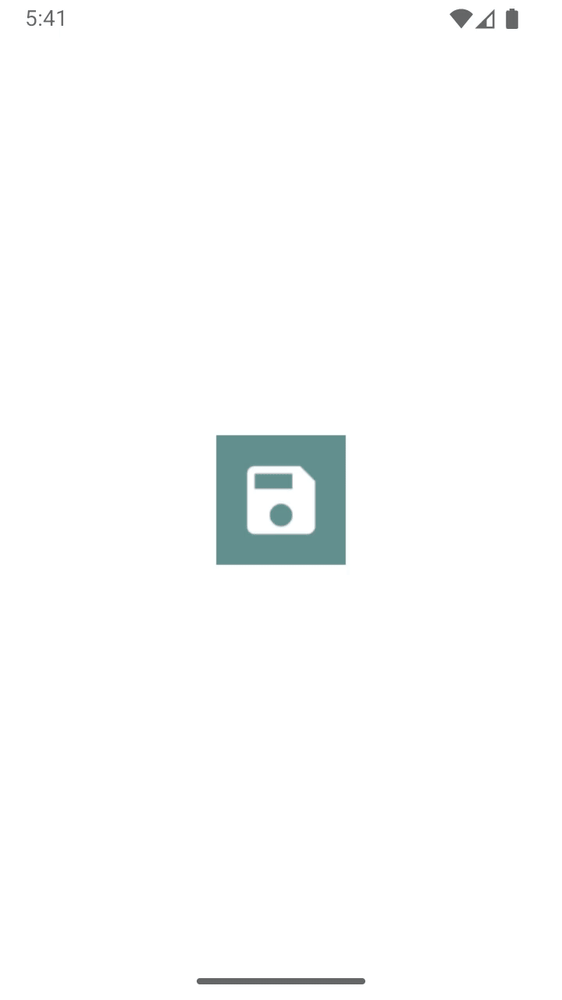

# Flutter Diary App

## Overview
The **Flutter Diary App** is a simple yet powerful journaling application that allows users to record their daily thoughts and experiences. It features user authentication, encrypted password storage, and a clean calendar interface to view past entries.



## Features
- User authentication (Register/Login/Logout)
- Secure password storage using SHA-256 encryption
- Create, update, delete, and view diary entries
- Calendar view with marked dates for existing diary entries
- Persistent storage using **SQLite** and **SharedPreferences**
- Clean and modern UI with **ScrollableCleanCalendar**

## Technologies Used
- **Flutter** for front-end development
- **SQLite (sqflite package)** for data storage
- **SharedPreferences** for storing user session data
- **Crypto (SHA-256 encryption)** for password security
- **ScrollableCleanCalendar** for calendar UI

## Installation
1. Clone the repository:
   ```sh
   git clone https://github.com/Adhishtanaka/diary.git
   ```
2. Navigate to the project directory:
   ```sh
   cd diary
   ```
3. Install dependencies:
   ```sh
   flutter pub get
   ```
4. Run the app:
   ```sh
   flutter run
   ```

## Usage
- **Register an account** using your name, email, and password.
- **Log in** to access your personal diary.
- **View the calendar** to see marked dates indicating saved entries.
- **Tap on a date** to view or edit an existing entry.
- **Add new diary entries** by pressing the floating action button.
- **Log out** securely when finished.

## Folder Structure
```
lib/
|-- main.dart (Entry point)
|-- ui/
|   |-- home_page.dart
|   |-- diary_detail.dart
|-- utils/
|   |-- auth_helper.dart
|   |-- diary_helper.dart
|   |-- db_helper.dart
```

## Contact

- **Author**: [Adhishtanaka](https://github.com/Adhishtanaka)
- **Email**: kulasoooriyaa@gmail.com

---

## Contributions
If you find any bugs or want to suggest improvements, feel free to open an issue or pull request on the [GitHub repository](https://github.com/Adhishtanaka/diary/pulls).

## License
This project is licensed under the MIT License. See [MIT License](LICENSE) for details.

Made with ❤️ using Flutter.

